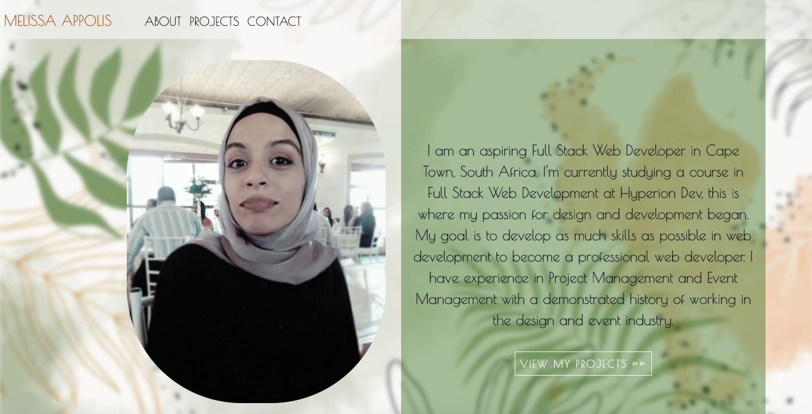
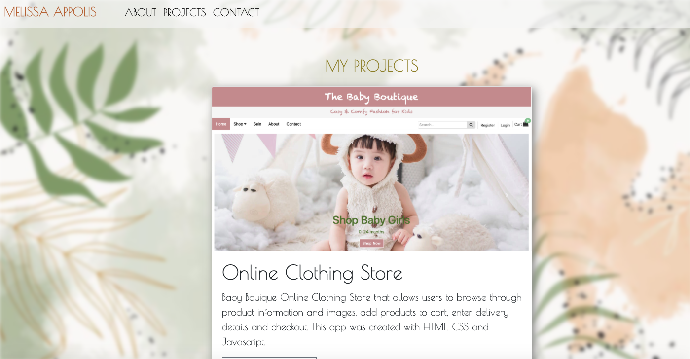

# Developer Portfolio - Next.js

## Description

This is my dynamic developer portfolio that showcases my projects I created thus far using Next.js.

Check out my [developer portfolio](https://developer-profile.vercel.app)

## Installation

Navigate to the project root folder, in your terminal type in `npm install`, once the node_modules are installed type in `npm run dev`.
Go to `http://localhost:3000`.

## Usage
### Landing Page
The landing page greets the user to my page with my name and occupation. The user is able to click on the "lets get to know me" button to learn more about me.
The user is able to navigate to all my pages using the navigation bar

### About Page
After clicking the "lets get to know me" button. The user will navigate to the about page.

### Projects Page
The projects page displays all the projects i have created.

### Contact Page
The contact page displays my contact details.

## Credits
Created by [@MelissaAppolis](https://github.com/MelissaAppolis)
